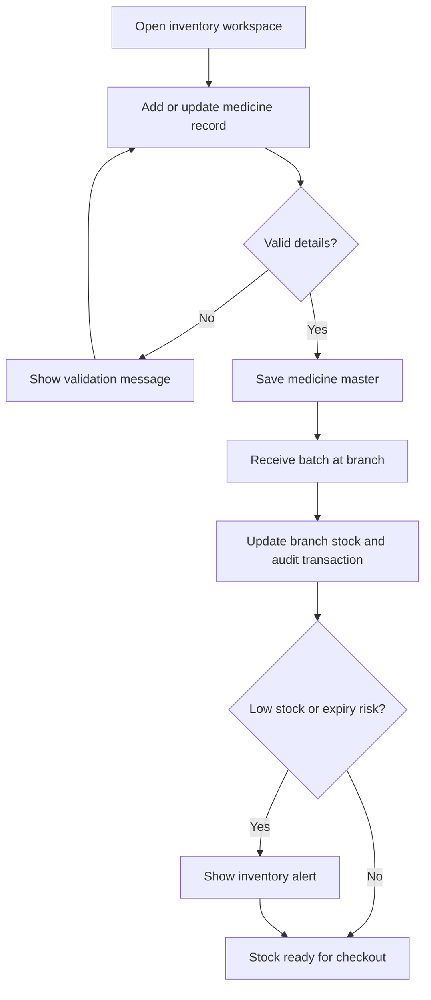
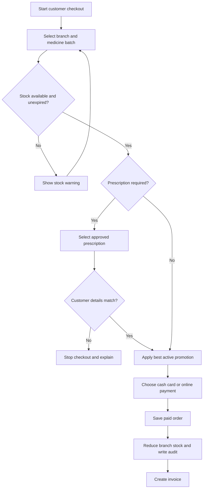
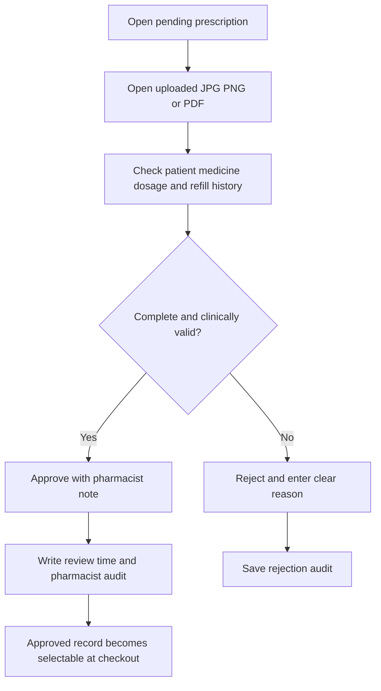
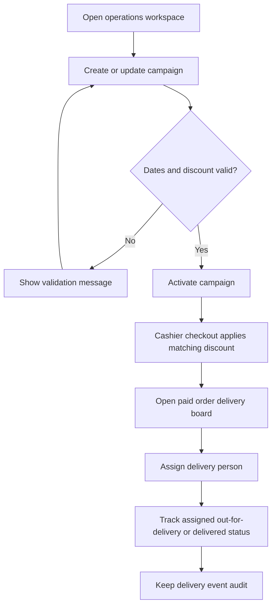
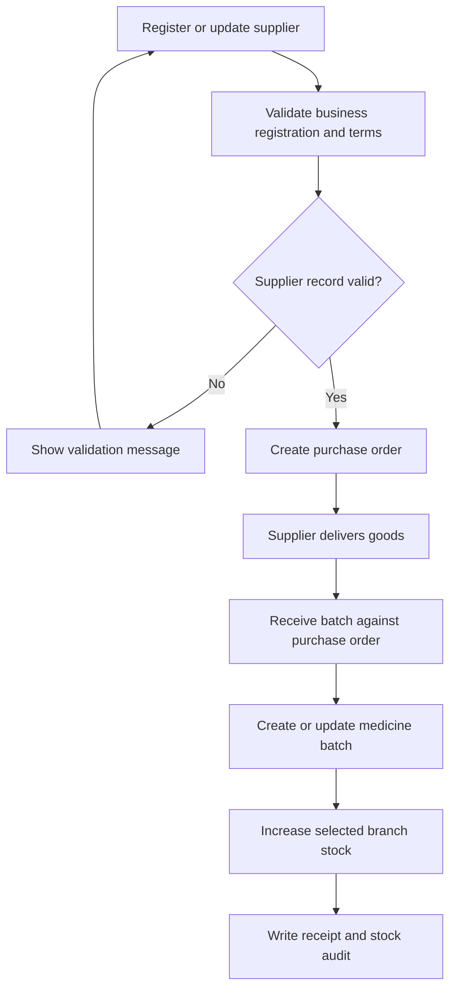
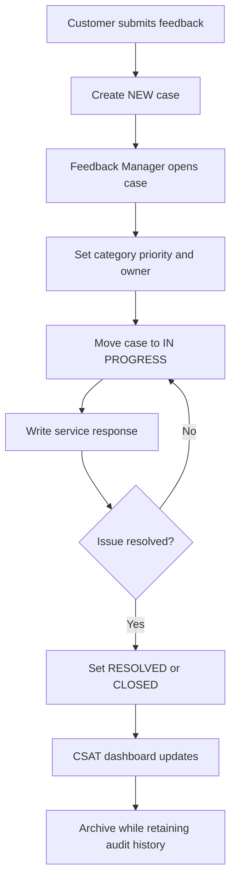

# MediCare for All - Activity Diagrams

These activity diagrams match the six team workspaces in the implemented system. Admin is the cross-module controller and can open every workflow.

## 1. Inventory Supervisor - Medicine and stock control

## 2. Cashier - Checkout and invoice

## 3. Duty Pharmacist - Prescription review

## 4. Operations Manager - Campaign and delivery coordination

## 5. Procurement Coordinator - Supplier to goods receipt

## 6. Customer Feedback Manager - Case management and CSAT

## Admin control

Admin can manage staff access, deactivate accounts without removing audit data, open every role workspace, and monitor the connected workflow dashboard.
